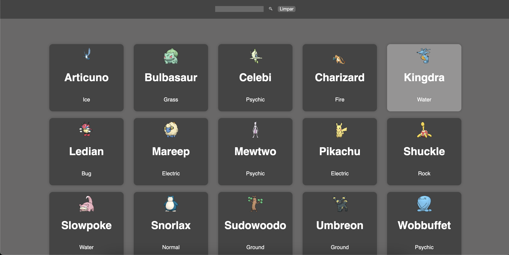

A aplicação construída durante o desafio final do programa MandaBem para o estágio em desenvolvimento de software na Mandarin.

Para o projeto foram usados NextJs, Typescript e Styled-Components. O deploy foi feito através da Vercel e pode ser acessado nesse [link](https://apipokemon-seven.vercel.app/ß)

## Especificação 
O desafio era construir uma página web que consumisse a [API](https://pokemon.mandarin.com.br/) e renderizasse na tela informações com nome dos pokemons, link da imagem e seu tipo. Além disso, havia um desafio extra em que necessário fazer uma consulta por meio da query que retornasse os pokemons buscados.

## Como rodar a aplicação

Para rodar a aplicação você pode seguir às instruções abaixo:


Para instalar as dependências basta executar o comando:
```bash
yarn 
```

Executando a aplicação

```bash
yarn run build 
```

```bash
yarn run start  
```

